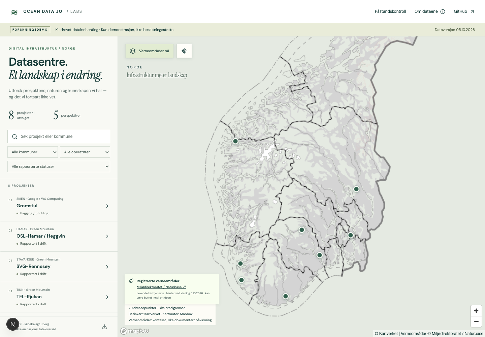

# Datasentre i Norge – åpen kartdemo

En kartbasert utforskning av norske datasenterprosjekter, med naturpåvirkning, kraft, areal, verdiskaping og eierskap som perspektiver.

> **KI-drevet datainnhenting. Kun demonstrasjon – ikke beslutningsstøtte.** Utvalget er ufullstendig, kildekontrollen er begrenset, og opplysninger kan være feil eller utdaterte.

**Åpne demoen:** [oceandatajo.com/labs/datasenter-analyse-norge](https://oceandatajo.com/labs/datasenter-analyse-norge). Se [verifikasjonsloggen](docs/implementation/verification-2026-10-05.md) for faktisk test- og deploystatus.



## Hva du kan utforske

- Åtte prosjekter med dokumenterte adressepunkter: Heggvin, Rennesøy, Rjukan, Enebakk, Undheim, Gromstul, Bulk N01 og Lefdal.
- Søk og filtre for kommune, operatør og rapportert prosjektstatus; delbare prosjektlenker.
- Fem temapaneler med daterte kilder, dokumentert usikkerhet og synlige kunnskapshull.
- Naturkort, verneområder, NiN-naturtyper, NiN-kartleggingsdekning og HB13 fra Miljødirektoratet som geografisk kontekst. Naturmenyen har tegnforklaringer og klikkbare fakta med kilder og årstall.
- Etterprøving av nasjonale påstander, med skille mellom medieomtale, publisert rapport og egen vurdering.
- Nedlasting av datauttrekket som vises i demoen.

Kartmotoren er Mapbox GL JS. Mapbox er standard basiskart; ved tilgangsfeil kan brukeren velge Kartverkets gråtonekart. Skjermbildet viser produksjonsløsningen med Mapbox.

## Datagrunnlag og begrensninger

Utgivelse `2026-10-05-r2` leser fire typede ODP-tabeller: **8 prosjekter, 93 påstander, 45 natur-/vannoppføringer og 77 kilder**. En femte tabell inneholder to planomriss og brukes ikke i kartet fordi kilde-CRS ikke er tilstrekkelig bekreftet. ID-er, skjema og forventede radantall finnes i [ODP-katalogen](config/odp-catalog.json). Datakolleksjon: `dc64cd07-753a-4956-be81-50dc60743ffa`.

Adressepunkter er **ikke anleggsgrenser**. Planareal er ikke det samme som faktisk nedbygd areal. Verneområdelaget dokumenterer ikke i seg selv naturpåvirkning, og fravær av kartlagte funn betyr ikke fravær av naturverdier. Naturpiloter finnes for Gromstul, Heggvin og Narvik; Narvik er foreløpig ikke blant kartets åtte prosjektpunkter.

Utvalget er ikke representativt for næringen. Målt årlig kraftbruk, validert faktisk arealbeslag, fullstendige eierkjeder og sammenlignbare økonomiske tall mangler for flere prosjekter. Kapasitet, forbruk, investeringer, omsetning og verdiskaping holdes atskilt. Manglende verdier vises som ukjent, ikke null.

Kildenes publiseringsdato, innhentingsdato og observasjonsperiode er forskjellige felt. Der publiseringsdato mangler, er den ukjent. Vi konstruerer ikke statistiske konfidensintervaller uten statistisk grunnlag. Dokumenterte spenn og kvalitative konfidensnivåer brukes der det passer; motstridende opplysninger beholdes som motstrid.

Teknologirådets analyserapport ble kontrollert 5. oktober 2026. Rapport, tidligere omtale og egne kontrollspørsmål holdes atskilt. Den underliggende databasen er ikke reprodusert. Se [rapportoppdateringen](research/rapportoppdatering-2026-10-05.md).

## Kjør lokalt

Krever Node.js 22 og npm. For levende data trenger du en ODP-nøkkel med lesetilgang til tabellene i katalogen.

```sh
npm ci
cp .env.example .env
# Fyll inn ODP_API_KEY og NEXT_PUBLIC_MAPBOX_ACCESS_TOKEN i .env
npm run dev
```

Åpne [localhost:3000/labs/datasenter-analyse-norge](http://localhost:3000/labs/datasenter-analyse-norge).

| Variabel | Bruk |
| --- | --- |
| `ODP_API_KEY` | Hemmelig servernøkkel; må ha tilgang til de fire tabellene |
| `ODP_API_BASE_URL` | `https://api.hubocean.earth`; appen tillater bare denne verten |
| `NEXT_PUBLIC_MAPBOX_ACCESS_TOKEN` | Offentlig `pk.*`-token for nettleseren, med passende domener og rettigheter |

Øvrige ODP-ID-felt i `.env.example` er for synkroniseringsarbeidsflyten; appen leser datasett-ID-er fra `config/odp-catalog.json`. `NEXT_PUBLIC_SITE_URL` er foreløpig ikke brukt av appen. Ikke legg hemmeligheter i `NEXT_PUBLIC_*` eller i Git.

## Arkitektur

Next.js App Router / React / TypeScript → serverruten `/api/atlas` → ODP Table API → Apache Arrow → validerte JSON-data til nettleseren. Alle appens ruter ligger under `/labs/datasenter-analyse-norge`.

ODP-nøkkelen forblir på serveren. Appen eksponerer de fire valgte tabellene som demoens offentlige datauttrekk, selv om ODP-katalogen er privat. Den eksponerer ingen generell ODP-proxy. Verneområder hentes gjennom en egen rasterproxy med fast leverandøradresse og validerte parametre.

Data bufres i fem minutter. Radantall, ID-er, koordinater og kildereferanser kontrolleres; ufullstendige eller endrede uttrekk gir en synlig feil. Det finnes ingen stille overgang til lokale kopier. Ved ny datautgivelse må katalog og forventninger oppdateres sammen.

## Tester

```sh
npm test
npm run typecheck
npm run build
# Med lokal dev-server, gyldig .env og Playwright Chromium installert:
npx playwright test
# Eller kontroller en deploy:
TEST_APP_URL=https://oceandatajo.com/labs/datasenter-analyse-norge npx playwright test
```

Enhetstester dekker filtrering, koordinatkontroll og kilde-URL-er. Nettlesertester dekker desktop/mobil, prosjektvalg, lenker, tomme søkeresultater, ODP-feil og alternativt basiskart. Integrasjonstestene krever nettverk og bruker ekte ODP- og karttjenester. Testene verifiserer produktets oppførsel, ikke sannhetsgehalten i alle forskningspåstandene.

## Deploy til Vercel og Labs

1. Koble dette repoet til Vercel-prosjektet `datasenter-analyse-norge`, med `main` som produksjonsgren og Next.js som rammeverk.
2. Legg inn variablene over for både Production og Preview. `ODP_API_KEY` skal være Sensitive/Secret. Tokenverdier kopieres ikke fra gateway-repoet.
3. Deploy og kontroller både nettsiden og `/labs/datasenter-analyse-norge/api/atlas`. HTTP 200 på nettsiden alene bekrefter ikke datatilgang.
4. Labs-gatewayen i [mpa-insights-generator](https://github.com/joevstaas/mpa-insights-generator) må ha både eksakt sti og understier vidererutet til `https://datasenter-analyse-norge.vercel.app` med samme basePath. Dette følger gatewayens eksisterende mønster; domenet tilhører gatewayen.

Git-push til produksjonsgrenen skal utløse Vercels Git-integrasjon. For manuell deploy: `npx vercel deploy --prod` fra en mappe som er koblet til riktig prosjekt.

**Feilsøking:** Appens 503 betyr at ODP-uttrekket ikke kunne valideres/hentes. Serverloggen bruker sanitiserte feilkoder, for eksempel `ODP_HTTP_403` ved avvist ODP-tilgang. Kontroller nøkkelens tabelltilgang og Vercel-miljø; redeploy etter endringer. Ved Mapbox 403 må tokenets rettigheter/domener kontrolleres, eller brukeren kan velge Kartverket.

## Dokumentasjon og bidrag

| Dokument | Innhold |
| --- | --- |
| [Naturmetode](docs/naturmetode.md) | Krav til naturspor, geometri og usikkerhet |
| [Datametode](docs/datametode.md) | Datering, enheter og kildekontroll |
| [Naturpiloter](research/natur/pilotrapport.md) | Gromstul, Heggvin og Narvik |
| [Prosjektutvalg](research/prosjekter.md) | Kilder og kunnskapshull |
| [Teknologirådet](research/teknologiradet.md) | Omtale, rapport og etterprøving |
| [Oppsett](docs/oppsett.md) | ODP og miljøvariabler |
| [Verifikasjon](docs/implementation/verification-2026-10-05.md) | Utførte kontroller og begrensninger |

Bidra gjerne med rettelser via issues eller pull requests. Oppgi prosjekt/påstand, primærkilde, dato, sidetall eller annen presis henvisning og hva kilden faktisk dokumenterer. Behold ukjente verdier og uenighet eksplisitt. Historiske arbeidsnotater beskriver status på skrivetidspunktet; denne README beskriver appen.

## Lisens og kilder

Prosjektets egen kode er MIT-lisensiert, se [LICENSE](LICENSE). Eksterne data, kart, dokumenter og sitater følger kildenes egne rettigheter og vilkår; MIT-lisensen gir ingen nye rettigheter til disse. Lokale PDF-er, HTML-kopier og tekstuttrekk fra tredjepartsdokumenter er ikke med i det offentlige repoet. Kildereferanser og dokumenterte analyser er beholdt.

Naturtypelagene vises fra zoomnivå 8; dekningskartet kan vises på oversiktsnivå. Tomme treff er ikke dokumentasjon på fravær av naturverdier. NiN og HB13 bruker ulik metodikk og summeres ikke. Se [lagdokumentasjonen](docs/implementation/nature-layers-2026-10-05.md).

## Quiz

`/quiz` har 10 tilfeldige flervalgsspørsmål (av 40) om datasentre i Norge, hentet fra Teknologirådets rapport. Spørsmålene ligger i `quiz/*.json` (med side- og kapittelhenvisning), og `lib/quiz.ts` trekker og blander dem. Resultatet kan deles som lenke (`/quiz/del/<poeng>-<faktum>`) med et generert bilde: 1200×630 for lenkeforhåndsvisning (`opengraph-image`) og 1080×1350 for Instagram (`/portrett`). Test: `npx playwright test tests/quiz.spec.ts`.
